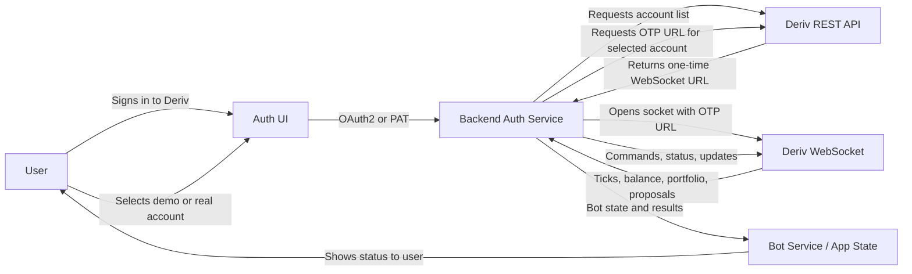

# Deriv API Reference

This document summarizes the Deriv API surfaces that matter for trading apps: authentication, WebSocket usage, market data, trading operations, account state, error handling, and reconnect behavior.

## Authentication

Deriv supports two auth paths for REST access:

- OAuth 2.0 apps with Authorization Code + PKCE.
- Personal Access Token (PAT) apps, where the user pastes a token into the client.

For REST calls, authenticated requests use `Authorization: Bearer <token>`. When using PAT auth, `Deriv-App-ID` is also required on REST requests.

For WebSocket trading, Deriv uses an OTP URL flow rather than a socket-level auth message:

1. Call `POST /trading/v1/options/accounts/{accountId}/otp` with the Bearer token.
2. The response returns a ready-to-use WebSocket URL in `data.url`.
3. Connect directly to that URL and send trading messages on the socket.

Do not send a top-level WebSocket `authorize` message on the OTP socket.

## Connection model

The bot should not ask the user for their Deriv password or try to manage a raw login session. The user authenticates with Deriv once, then the backend obtains a one-time WebSocket URL for the selected demo or real account.



In practice:

- The user enters Deriv sign-in details only in Deriv’s auth flow, not into the bot itself.
- The backend receives the selected account context and requests a fresh OTP URL.
- The bot connects using that OTP URL and keeps trading or subscribing on that socket.
- If the socket drops or the user switches accounts, the backend fetches a new OTP URL and reconnects.
- The OTP URL is one-time and should not be stored as durable application state.

## WebSocket connection

Deriv exposes three WebSocket gateways for Options trading:

- Public market data: `wss://api.derivws.com/trading/v1/options/ws/public`
- Demo trading: `wss://api.derivws.com/trading/v1/options/ws/demo?otp=...`
- Real trading: `wss://api.derivws.com/trading/v1/options/ws/real?otp=...`

The public socket requires no authentication and is suitable for ticks, symbols, and other read-only market data.

Authenticated sockets are account-scoped through the OTP URL. The URL is one-time and short-lived; treat it as a connection credential, not durable session state.

## Market subscriptions

Most live streams are requested by adding `subscribe: 1` to the WebSocket payload.

Useful subscription controls:

- `forget` unsubscribes a single stream by subscription id.
- `forget_all` unsubscribes all streams of a given type, or a list of types.
- `req_id` helps correlate requests and responses.

Deriv’s own subscription manager keeps one stream per unique request, reuses equivalent subscriptions, and cleans up forgotten or completed streams.

## Tick data

Market data is usually driven by these requests:

- `active_symbols` to discover tradable symbols and metadata.
- `ticks` to subscribe to a live tick stream.
- `ticks_history` to fetch historical ticks.

Typical flow:

1. Fetch active symbols and determine the symbol metadata you need.
2. Request historical ticks for the selected symbol.
3. Subscribe to live ticks and merge them at the history boundary without duplicates.

Public data can be read without auth on the public WebSocket gateway.

## Contract and order operations

Trading work happens on the authenticated WebSocket.

Core flow:

- `proposal` gets a price proposal for a contract.
- `buy` executes the contract using a proposal id or direct contract parameters.
- `sell` closes an open contract before expiry.
- `cancel` cancels a contract when the contract type supports it.
- `proposal_open_contract` streams the live state of an open contract.
- `contract_update` and `contract_update_history` manage supported contract adjustments and the audit trail for those changes.

Deriv’s documented lifecycle is generally:

1. Authenticate.
2. Request a proposal.
3. Buy from that proposal.
4. Monitor the open contract.
5. Sell, cancel, or update only when the contract state supports it.

## Account information

Account-scoped information is exposed through authenticated WebSocket requests such as:

- `balance` for the current account balance.
- `portfolio` for open options contracts.
- `profit_table` for aggregated P/L summaries.
- `statement` for account statements.
- `transaction` for transaction notifications.

The `balance` stream can subscribe to updates, and `portfolio` gives the open position set that can later feed `proposal_open_contract` and related monitoring.

## Position state

For open positions and contract state, use:

- `portfolio` to list outstanding open contracts.
- `proposal_open_contract` to get the latest status of a single contract or all open contracts.

The live contract stream is the primary source for state transitions such as open, sold, expired, or updated conditions.

## Error responses

WebSocket errors are delivered in the response envelope as an `error` object with `code` and `message`, alongside the `msg_type` that triggered the error.

Example shape:

```json
{
  "error": {
    "code": "InputValidationFailed",
    "message": "Missing required parameter underlying_symbol"
  },
  "msg_type": "proposal"
}
```

Common error classes called out in the docs include:

- `InvalidToken`
- `RateLimit`
- `InputValidationFailed`
- `ContractNotFound`
- `InsufficientBalance`
- `ValidationError`
- `NotFound`
- `Unauthorized`
- `InternalError`

Practical rule: check the `error` field before reading success payload fields.

If a WebSocket request is rejected or the OTP expires, request a fresh OTP URL and reconnect.

## Reconnect behavior

Deriv’s own WebSocket implementation keeps connections alive with periodic ping traffic and reconnects when the socket closes, unless the caller supplied an already-open connection.

Recommended reconnect rules:

- Send a `ping` roughly every 30 seconds to keep the connection alive.
- Use bounded, exponential backoff for transient reconnect attempts.
- For authenticated trading, fetch a fresh OTP URL before opening the replacement socket.
- Do not reuse a consumed OTP URL as reconnect credentials.
- Increment the connection generation before accepting messages from a replacement socket.
- Restore only the currently relevant public streams and still-open contract subscriptions.
- Rebuild account-scoped state after account switches or socket replacement.

For public market data, reconnecting can be simpler because it is not tied to an account-scoped OTP URL.

## Practical usage notes

- Prefer the public WebSocket for read-only market data.
- Use the authenticated WebSocket only for account-scoped trading and monitoring.
- Keep the auth/session/account owner separate from the transport owner so reconnect and account switching remain deterministic.
- Never store OTP URLs as durable application state.
- Always clean up streams with `forget` or `forget_all` when a view or workflow ends.

## Official references

- [API Overview](https://developers.deriv.com/docs/intro/api-overview/)
- [Authentication](https://developers.deriv.com/docs/intro/authentication/)
- [Market Data](https://developers.deriv.com/docs/data/)
- [Trading Operations](https://developers.deriv.com/docs/trading/)
- [Account Management](https://developers.deriv.com/docs/account/)
- [Subscription Management](https://developers.deriv.com/docs/subscription/)
- [System](https://developers.deriv.com/docs/system/)
